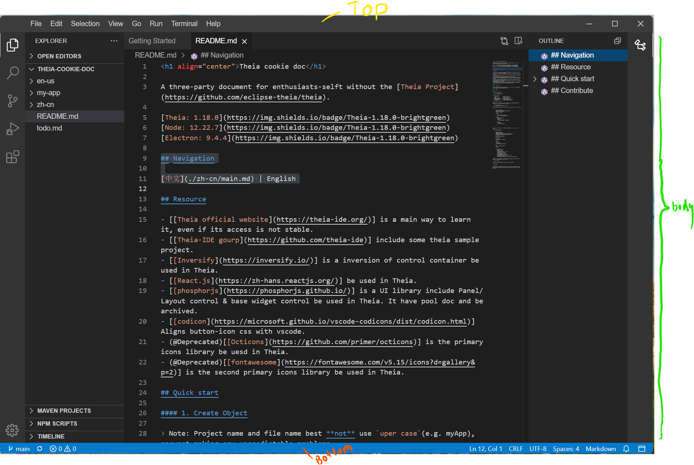

Theia application layout is a conventional desktop application, same as visual studio code.

Application layout from top to bottom are:

- Top: Top panel include App Logo, Main menu and Window button.
- Body: Body panel is a split panel, include main content.
- Bottom: Only a statusBar component.



This body panel uses a split layout include 4 areas, from left to right are: `Left Side`, `Dock Panel`, `Right Side`.


`Left Side` and `Right Side` are a docking bar and a hideable panel.

`Dock Panel` split main panel and bottom panel, main panel be use to docking editor, bottom panel has common UI eg. 'Problem', 'Output', 'Console', 'Terminal'.


Known the layout of theia helps to use it, eg. set widget contribution area option:

```
class YourWidgetContribution{
    constructor(){
        super({
            defaultWidgetOptions: {
                area: "main", // add widget in main of `Dock Panel`
                //area: "top", // add widget in `Top`
                //area: "left", // add widget in `Left Side`
                //area: "right", // add widget in `Right Side`
                //area: "bottom", // add widget in bottom of `Dock Panel`
            },
        })
    }
}
```
